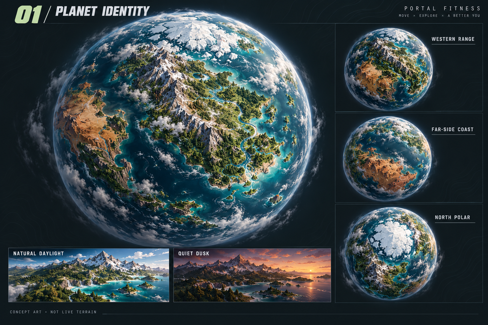
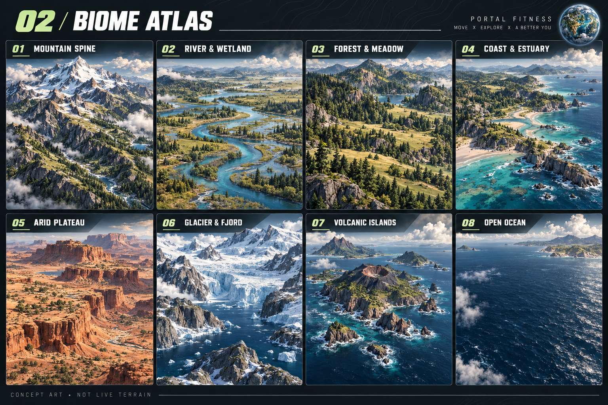
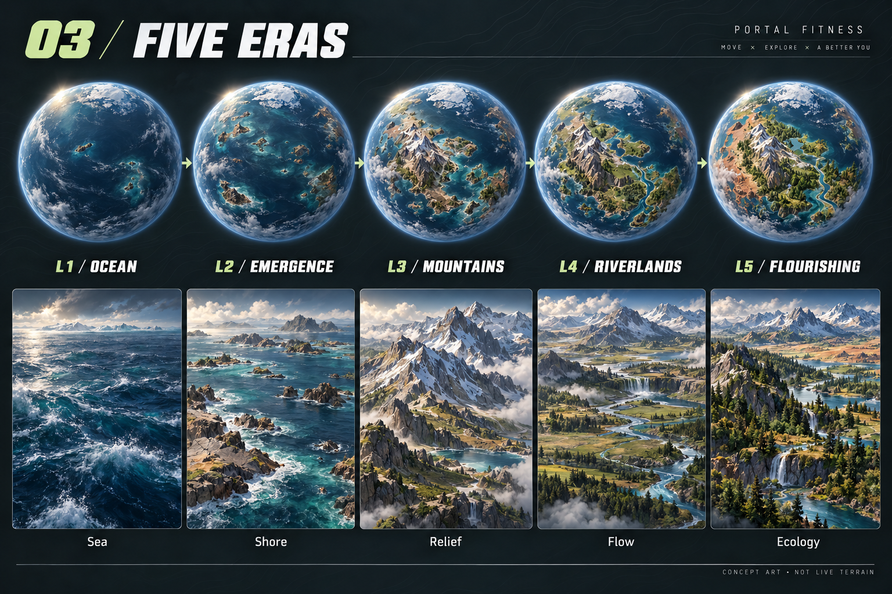
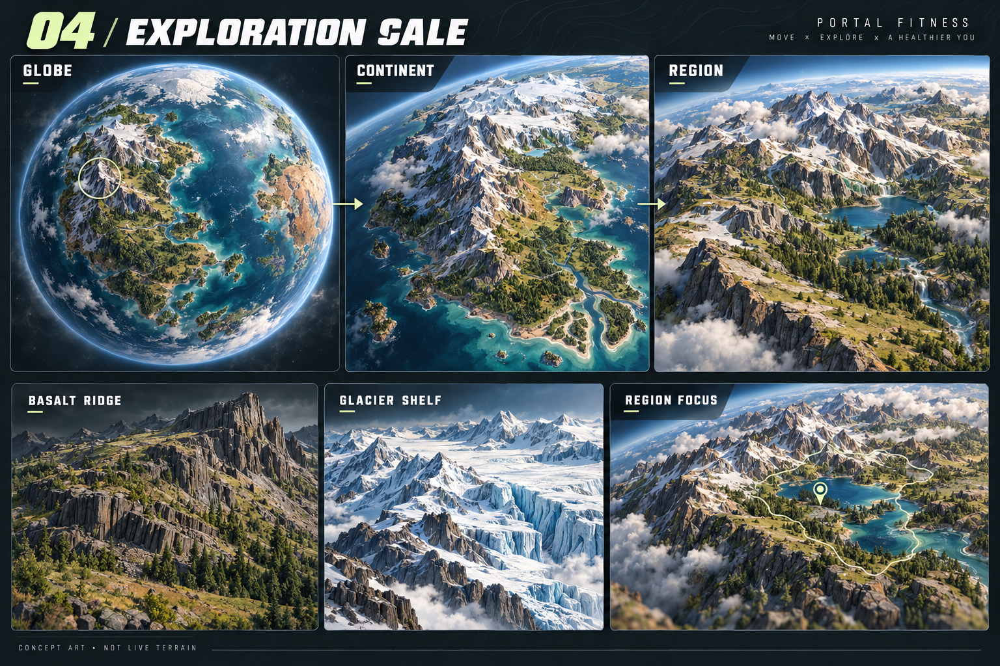
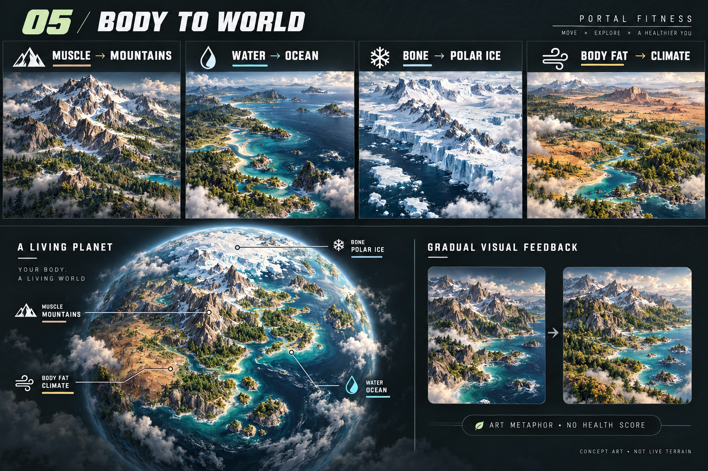

# 星球视觉概念图册

<!-- 2026-10-06：ChatGPT 使用内置 imagegen 按选定暗黑潮流/自然地貌风格生成完整专题图册；仅作为美术参考，未接入 APP。 -->

五张图延续 [Planet 交互概念](../../visual-interactions/2026-10-06/03-planet-explore-region-states-v1.png) 的世界与配色，并与都市美漫轻度写实人物配套。画法为精细而概括的游戏地貌，采用暗色展示底、自然岩层、深蓝海洋、低饱和森林和冷白冰盖。

| 图 | 内容 | 评审重点 |
| --- | --- | --- |
| [01 全貌与多视角](01-planet-overview-v1.png) | 主视角、山脉侧、远侧海岸、北极，日光/暮色景观 | 完整连续球体、稳定识别锚点、各侧的生态差异 |
| [02 八类地貌](02-planet-biome-atlas-v1.png) | 山脉、河流湿地、森林草原、海岸河口、干旱高原、冰川峡湾、火山岛链、开放海洋 | 统一材质与尺度、丰富但克制的地貌关系 |
| [03 五阶段演化](03-planet-five-eras-v1.png) | 沧海 → 露陆 → 山脉 → 江河 → 丰壤，球体与对应近景 | 同源演化、阶段差异、后期保留前期结构 |
| [04 探索尺度](04-planet-exploration-scale-v1.png) | 全貌 → 大陆 → 区域，玄武岩山脊与冰舌参考 | 地理连贯、轨道相机层次、低干扰区域聚焦 |
| [05 身体数据映射](05-planet-body-data-mapping-v1.png) | 肌肉/水分/骨量/体脂对应山脉/海洋/极地/气候 | 四指标艺术语义、完整生态融合、渐进反馈 |

生成方式为内置 `image_gen.imagegen`，每个主题单独生成，非 CLI。每张为 1536×1024 PNG，实际使用的完整提示词和参考路径保存在 [prompts.json](prompts.json)；文件名与图册对应。原生成文件保留在 Codex 默认目录，项目使用的副本已保存到本目录。

## 01 全貌与多视角

## 02 地貌与生态

## 03 五阶段

## 04 探索尺度

## 05 身体数据语义

## 使用边界与生产依据

这些是设计评审图，不是运行截图、球面贴图、GLB、可点击原型或已完成数据演化的证据。图片中的地理细节存在生成式视角差异；正式多视角必须由同一个地形源和种子输出。板中近景只说明环境材质，未定义地面探索功能。

四指标不相加形成球面面积，不定义健康评分；体脂的气候语义保持中性。阶段解锁、变化幅度与 XP 规则未定，当前 APP 只更新指标，不重建几何。图05的轻微视觉反馈为候选表达，准确边界见 [星球规范](../PLANET_ART.md)。

美术落地使用 [ART_DIRECTION](../ART_DIRECTION.md) 和 [PLANET_ART](../PLANET_ART.md)，功能与页面使用 [PAGE_CONTENT](../PAGE_CONTENT.md)。保持当前统一程序化 renderer，不将整张图册贴进应用。
