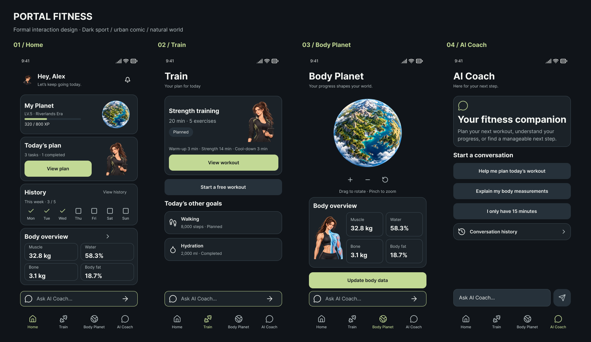
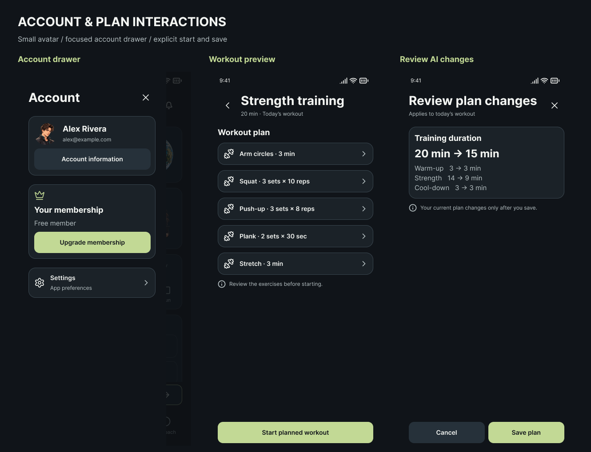

# Portal Fitness 正式交互稿 V1

日期：2026-10-11。依据用户选定的都市美漫 + 轻度写实、暗黑潮流运动与自然生态风格，将截至 V6 的页面概念整理为独立的原生 Figma Design 文件。

**[打开可编辑 Figma 文件](https://www.figma.com/design/ccBI9Wxbj1gTnZI9D6yplY)** · **[从首页演示交互](https://www.figma.com/proto/ccBI9Wxbj1gTnZI9D6yplY?node-id=5-2&starting-point-node-id=5%3A2&scaling=scale-down)**

文件名称：`Portal Fitness · 正式交互稿 V1 · 2026-10-11`。在 `01 · Interactive flows` 页选择右上角 Present，切换 14 个 flow 入口。产品文案为英文；本文为中文交接说明。

## 交付内容

| Figma 页面 | 内容 |
| --- | --- |
| `01 · Interactive flows` · `0:1` | 89 个 390 × 844 页面状态与 14 个演示入口；501 个有效跳转关系 |
| `02 · Design system` · `2:2` | 4 个原生组件集、23 个状态变体；共 61 个主组件，包含 34 个 Lucide 图标；7 个 Inter 文本样式、3 个变量集合和 30 个变量 |
| `03 · Handoff & rules` · `2:3` | 四个主页面总览、账户/训练/AI 交互详情、9 项开发交接规则 |

UI 文本、卡片、输入、按钮、导航、图标和组件实例均为可编辑原生节点。位图仅用于四张独立人物/星球插画。最新节点索引为 [screen-state-final.json](screen-state-final.json)，结构与流程检查为 [validation.json](validation.json)，组件实际计数为 [library-validation.json](library-validation.json)。

## 最新决策的落实

- Home / Train / Body Planet / AI Coach 四项导航；账户入口在 Home 左上，30px 头像与 18px 提醒图标均保留 44px 点击区。
- 左侧账户抽屉只放账户信息、Membership / Upgrade membership、Settings；不重复周目标或训练统计。
- Home 保留星球、今日计划、历史、身体概览四个区域；Home、Train、Body Planet 的 AI 横框固定在导航上方。
- Train 分为自由开练与有计划预览；进入预览不开始计时。自由训练支持选动作、训练中加入 Plank、暂停、休息、提前结束和完成。
- Body 与 Planet 融合；球体中不放人物。身体概览下方使用成熟人物的半侧解剖插画，肌肉/水分/骨量/体脂各有对应区域与聚焦状态。
- AI Coach 使用独立输入框，键盘显示时隐藏导航；AI 修改计划必须先查看差异再保存。缩短到 15 分钟后，首页与训练内容保持一致。

## 页面状态

| 范围 | 数量 | 覆盖 |
| --- | ---: | --- |
| H01–H10 | 10 | 首页、今日计划、编辑/取消/保存、无计划、历史、通知、15 分钟保存状态 |
| A01–A06 | 6 | 左侧抽屉、账户、编辑账户、设置、会员方案不可用、减少动态效果 |
| T01–T39 | 39 | 两种入口、动作选择、计划预览、20/15 分钟计划、自由会话、暂停/休息、完成/部分完成、保存失败、会话中加动作后继续 |
| B01–B17 | 17 | 融合页、四指标选择/聚焦、数据草稿、字段错误、失败/成功、无数据/载入/渲染失败、输入聚焦 |
| AI01–AI17 | 17 | 欢迎、Home/Train/Body 上下文、草稿、生成/停止、计划建议/差异确认/保存、错误、键盘、历史、版本冲突、身体问题回复 |

## 原型与实施规则

| 流程 | 演示路径 | 实施要求 |
| --- | --- | --- |
| 今日计划编辑 | H01 → H02 → H03 → H08 → H04 → H10 | 原型用 20 → 15 分钟演示草稿；取消不改已保存计划。步数、饮水步长及范围由产品规则确定后实现 |
| 自由开练 | T01 → T04 → T05 → T06 → T07 → T19 → T29 → T31 | 进入 Train 不计时；确认动作后训练。保留自由会话来源 |
| 按计划开练 | T02 → T03 → T08 → T09 → T28 → T12 | 先预览再显式开始；运行会话使用开始时的计划快照 |
| 训练中加动作 | T07 → T22 → T23 → T33 → T35 → T37 → T38 | 加入 Plank 后保留三动作列表；暂停恢复不丢动作；部分完成只记录已完成项 |
| 身体数据 | B01 → B07 → B10；B08/B09 为异常入口 | 独立草稿；kg 为正数，百分比 0–100；保存成功后同步指标与球体，失败保留草稿 |
| AI 修改计划 | AI01 → AI03 → AI04 → AI05 → AI06 → AI07 → T17 | 建议只生成草案；查看差异并显式保存；正在进行的训练不被覆盖 |
| 身体 AI 问题 | B01 → AI13 → AI15 → AI16 → AI17 → B01 | 使用已保存的身体上下文；快捷问题先填草稿，再由用户发送 |

14 个原型入口包含主流程与训练保存失败、字段验证、身体保存失败、无身体数据、星球载入/失败、AI 发送失败/不可用、计划版本冲突。它们可从 Figma Present 的 flow 选择器独立进入。

Figma 用预置数值、文案和独立画面演示状态；输入键盘、计时和 5 秒 AI 生成等待均为示意，训练中间组次有压缩。会员方案、价格、周期、权益及支付渠道待定义，因此只交付会员入口和方案不可用状态。真实聊天服务、账号存储、付款、历史持久化、实时星球旋转/地形演化仍按 [PAGE_CONTENT](../../design/PAGE_CONTENT.md) 实施。

## 视觉资产与本地文件

| 资产 | 用途 |
| --- | --- |
| [maya-sport.png](assets/maya-sport.png) | 成熟美漫运动搭档，首页与训练陪伴 |
| [maya-body-analysis.png](assets/maya-body-analysis.png) | 身体概览的半侧解剖表达 |
| [alex-account.png](assets/alex-account.png) | 演示账户头像 |
| [riverlands-planet.png](assets/riverlands-planet.png) | 完整山地、森林、河湖球体 |

[assets.json](assets.json) 记录生成依据与 SHA-256，[asset-upload-state.json](asset-upload-state.json) 记录已上传的 Figma 图片哈希。四张图是本轮设计资产，位于 `docs/`；没有作为运行资产接入 `public/assets/`。解剖插画是视觉表达，不代表真实扫描或诊断。

本地保存总览、交互详情、四个主页面截图、资产、节点索引、制作脚本和验证记录。Figma 在线源文件是可编辑交付。`tools/` 中的 JavaScript 为分阶段 Figma Plugin API 制作记录，需要相应上下文和实际节点 ID；初始化脚本不要对现有文件重复执行，避免创建重复节点。后续修改应使用最新节点索引并更新验证。

## 验证记录

- 已读取实际 Figma 节点验证 89 个非空状态，均为 390 × 844，1199 个文本节点使用 Inter。
- 501 个原型跳转的目标均有效；12 条关键点击路径通过结构检查；可点击区域不足 44px 的节点为 0。
- 首页正文 584px / 可视区 588px，Body Planet 正文 532px / 可视区 532px；主要内容首屏完整。
- 已下载并目视检查 Figma 的总览与交互详情截图，修正卡片裁切、按钮换行、AI 输入框顺序及图标缩放。
- 本轮为正式设计交付；未修改运行应用源码，未进行运行应用功能验收。实际开发还需验证 320/390/430px、软键盘、滚动、焦点、减少动态效果与服务异常。

项目设计规范同步更新为 [设计入口 1.7](../../design/README.md)、[美术方向 1.1](../../design/ART_DIRECTION.md) 与 [页面实施交接 1.7](../../design/PAGE_CONTENT.md)。
