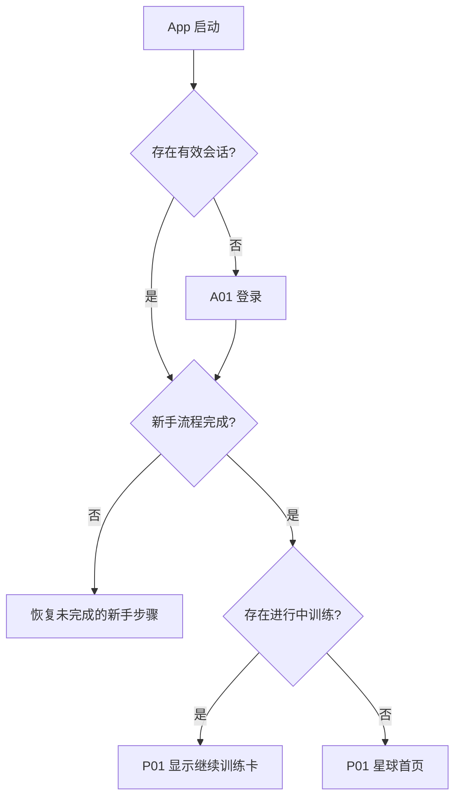
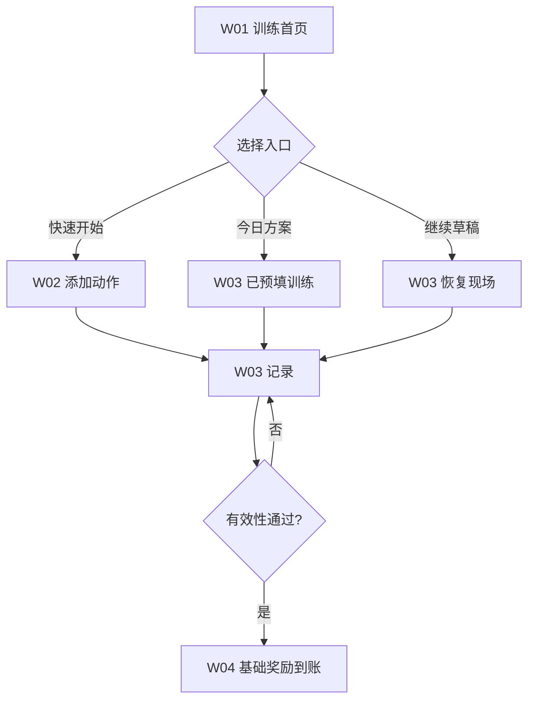
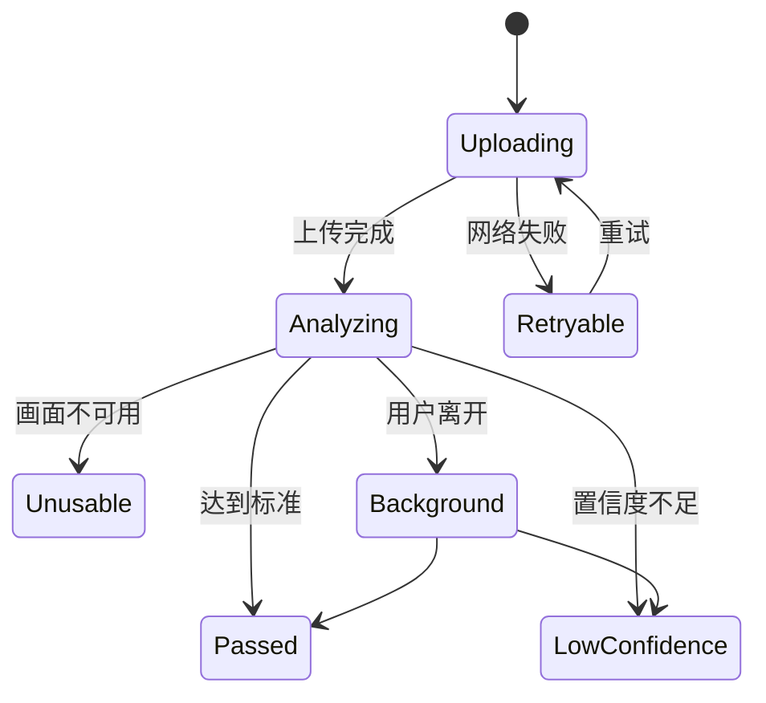

# Portal Fitness 手机端交互逻辑

> 版本：1.0  
> 更新日期：2026-09-15  
> 产品规则依据：[Portal Fitness MVP 产品方案](product-spec.md)

本文定义信息结构、操作顺序、状态变化和异常恢复，不规定具体视觉风格。

## 1. 全局交互约定

### 1.1 一级导航

登录后默认进入“星球”。底部导航固定为：**星球 / 训练 / 方案 / 我的**。

- 切换 Tab 时保留各 Tab 的列表位置和筛选条件。
- 训练中、视频录制/分析中、初始星球生成和进化仪式中隐藏底部导航。
- 动作库从训练或方案进入，返回时回到原调用页面并保留已选动作。
- 系统推送或深链打开二级页时，返回优先回到对应一级 Tab。

### 1.2 返回与退出

| 场景 | 返回行为 |
| --- | --- |
| 普通二级页 | 返回上一级，并保留上一级滚动位置和输入状态 |
| 新手引导 | 返回上一步；已保存字段继续保留 |
| 训练进行中 | 弹出“保存草稿并退出 / 继续训练 / 放弃训练” |
| 视频录制中 | 停止录制后确认离开；不影响基础训练奖励 |
| 视频分析中 | 允许离开，后台继续；结果写入消息中心和训练详情 |
| 进化生成中 | 允许转后台；回到星球时显示任务状态 |
| 进化预览 | 返回即放弃当前预览，不扣 Credit，需二次确认 |

### 1.3 通用状态

每个数据页面必须覆盖首次加载、正常、有数据空态、局部失败、整页失败、离线、无权限。提交按钮在请求中禁用，重复点击不得重复创建记录或奖励。

反馈优先级：阻断错误显示原因和恢复动作；非阻断异常用顶部轻提示；成功先更新数值再播放可跳过动效；后台任务提供持续可返回的状态入口。

## 2. 页面地图

| ID | 页面 | 入口 | 成功出口 |
| --- | --- | --- | --- |
| A01 | 欢迎/登录 | 冷启动、退出登录 | A02 或 P01 |
| A02 | 基础资料 | 首次注册 | A03 |
| A03 | 目标与限制 | A02 | A04 |
| A04 | 星球创建 | A03 | A05 |
| A05 | 初始生成 | A04 | P01 |
| P01 | 星球首页 | 默认 Tab | P02、P03、W01、E01 |
| P02 | 每日额度 | P01 | P01 |
| P03 | 星球全览 | P01 | P01、E01 |
| W01 | 训练首页 | 训练 Tab、P01 | W02、W03、R02 |
| W02 | 动作库 | W01、W03、L02 | 返回调用页 |
| W03 | 训练记录 | W01、W02、L01 | W04 |
| W04 | 训练完成 | W03 | V01 或 W05 |
| V01 | 视频录制/上传 | W04 | V02 或 W05 |
| V02 | AI 分析结果 | V01 | W05 或 V01 |
| W05 | 训练结算 | W04、V02 | P01、R02 |
| E01 | 进化门槛 | P01、P03、W05 | E02 |
| E02 | 进化生成与预览 | E01 | P03 或 P01 |
| L01 | 方案列表 | 方案 Tab | L02、W03 |
| L02 | 方案编辑 | L01 | L01、W02 |
| R01 | 我的 | 我的 Tab | R02、R03、R04、R05 |
| R02 | 训练历史/详情 | R01、W05 | R01 |
| R03 | Credit 明细 | R01、P01 | R01 |
| R04 | 体成分 | R01 | R01 |
| R05 | 隐私与数据 | R01 | R01 或 A01 |

## 3. 冷启动与登录分流

- 冷启动先读取本地会话和草稿，再请求服务端增量数据。
- 会话失效时保存本地训练草稿，登录成功后询问是否合并。
- 新手步骤按服务端 `onboarding_step` 恢复，不能每次从头开始。

## 4. 账户与新手引导

### A01 欢迎/登录

- 输入手机号/邮箱并获取验证码；验证码通过后登录或自动创建账户。
- 服务协议和隐私政策必选，营销授权单独可选。
- 已注册用户进入启动分流；新账户进入 A02。
- 账号格式、验证码错误、验证码过期、频控和网络错误分别提示。

### A02 基础资料

- 昵称必填；其他字段可跳过。
- 保存成功后进入 A03。网络失败保留输入，不清空表单。
- 数值异常只做非阻断确认，不给健康结论。

### A03 目标与限制

- 主要目标单选；每周训练频次单选；器械和限制部位多选。
- 选择“存在疼痛或限制”后展开部位和说明，不要求填写疾病名称。
- 继续前说明数据只用于筛选动作和计划。

### A04 星球创建

- 选择气候种子并输入名称，实时显示静态预览。
- 点击创建后锁定本次请求，进入 A05；重复点击不能创建多个星球。
- 名称可在创建后修改；初始气候种子不影响积分公平性。

### A05 初始生成

- 0–8 秒显示进度和生成说明。
- 超过 8 秒转后台任务，允许进入简化星球首页；首页持续显示生成状态。
- 成功进入 P01；失败提供重试，沿用同一创建请求。

## 5. 星球主线

### P01 星球首页

页面按顺序展示：当前星球与阶段、可用 Credit、下一次进化双门槛、每日额度、今日训练/继续训练、最近变化。

| 状态 | 主操作 | 次操作 |
| --- | --- | --- |
| 当日未签到 | 领取 +5 | 开始训练、查看全览 |
| 已签到且无草稿 | 开始训练 | 查看全览、进化详情 |
| 有训练草稿 | 继续训练 | 放弃草稿、查看全览 |
| 进化已就绪 | 开启进化 | 继续积累、查看全览 |
| 生成进行中 | 查看生成进度 | 开始训练 |

首页等待服务端确认后再更新余额；到账动效不能先于真实入账。

### P02 每日额度

- 从 P01 点击“领取”后使用轻量确认层或页内展开，不需要多级页面。
- 成功后显示 `+5`、新余额和今日已领取状态。
- 重复领取返回同一交易结果，不显示错误。
- 离线时不本地预发；记录待重试请求，联网后自动提交并提示结果。

### P03 星球全览

- 单指旋转、双指缩放；点击地貌查看本周期贡献与对应训练类型。
- 提供“恢复默认视角”，不依赖手势才能完成核心操作。
- 低性能或开启“减少动态效果”时使用静态版本图。
- 进化就绪时显示 E01 入口；生成中的区域不可重复开启任务。

## 6. 训练记录流程

### W01 训练首页

- 有草稿时“继续训练”是唯一主操作，快速开始和方案入口下移。
- 快速开始创建空草稿并进入 W02。
- 点击方案跳转 L01；选择方案后创建带来源 ID 的草稿。

### W02 动作库

- 搜索即时匹配名称、别名、部位、器械和类型。
- 筛选项可多选；“清除”恢复默认，不清空搜索词。
- 点击动作加入当前训练；多选模式显示已选数量和“完成添加”。
- 无结果时提供清除筛选与“自定义活动”；自定义活动只支持时长记录。

### W03 训练记录

通用操作包括计时、添加动作、拖动排序、备注、保存草稿和完成训练。

- 力量：复制上一组、增删组、勾选完成；未勾选的预设组不计入结算。
- 距离：输入距离与时长后计算配速；修改任一值即时更新。
- 游泳：泳池长度改变时提示是否重算趟数，不静默覆盖用户输入。
- 时长：支持暂停和继续，后台计时以系统时间差校准。
- 每次有效修改先写本地草稿，再异步同步；顶部显示最后同步状态。

点击完成后依次执行：

1. 标记缺失或无效字段，并滚动到第一个问题。
2. 展示完成摘要，用户确认后提交。
3. 服务端锁定快照并结算基础 Credit。
4. 成功进入 W04；超时保持“结算中”，禁止再次完成。

### W04 训练完成

必须先展示“训练已完成”和基础 Credit 数值，再提供：

- 主操作：录制一个动作，争取额外 +15。
- 次操作：跳过并查看结算。

只有本次训练包含视频识别白名单动作时才展示录制入口；否则直接进入 W05，并说明当前动作暂不支持视频加成。

### W05 训练结算

展示训练摘要、基础奖励、视频奖励、每日封顶影响、新余额和下一进化门槛。主操作为“回到星球”，训练详情为次操作。

- 进化已就绪：主操作改为“回到星球开启进化”。
- 视频仍在后台分析：显示“基础奖励已到账，视频结果稍后追加”。
- 返回星球后展示一次能量注入；重复进入不重复播放完整仪式。

## 7. 视频核验流程

### V01 录制/上传

进入时先选本次训练中的一个白名单动作，再展示拍摄指导。

1. 首次点击录制时请求相机权限。
2. 权限通过后显示全身取景框、推荐角度、倒计时和 8–15 秒范围。
3. 录制结束进入预览，可重录或提交。
4. 相机拒绝时提供“去设置”“从相册选择”“跳过”，不循环请求权限。

上传前校验时长、文件类型、大小和单人完整入镜；失败留在预览并给出可操作建议。

### V02 AI 分析与结果

- 通过：服务端追加一次 +15，进入 W05。
- 低置信度/不可用：展示原因，主操作为重录，次操作为跳过。
- 分析超过 10 秒：允许转后台并进入 W05；结果完成后更新账本和训练详情。
- 用户在结果返回前退出账号：服务端仍完成任务，重新登录后显示结果。

## 8. 进化流程

### E01 进化门槛

| Credit | 时间 | 页面状态 | 操作 |
| --- | --- | --- | --- |
| 未达标 | 未达标 | 积累中 | 查看建议训练 |
| 已达标 | 未达标 | 等待周期 | 查看倒计时 |
| 未达标 | 已达标 | 等待能量 | 查看 Credit 差额 |
| 已达标 | 已达标 | 已就绪 | 开启进化 |

点击“开启进化”前展示本次将消耗的 Credit、输入周期和主要训练贡献。确认后冻结输入快照并进入 E02。

### E02 生成与预览

- 生成中：展示阶段和可离开说明；同一任务不可重复提交。
- 生成成功：切换查看前后版本，展示地貌变化及其训练来源。
- 确认保存：原子地创建新版本并扣除 Credit，成功后返回 P03。
- 放弃预览：返回 E01，不扣 Credit；再次生成可能得到不同结果。
- 失败/超时：回到可重试状态，不扣 Credit；保留失败任务 ID 供排查。

## 9. 训练方案

### L01 方案列表

- 默认展示今日方案、用户方案和示例方案。
- 点击方案查看详情；“开始”创建训练草稿并进入 W03。
- 已有训练草稿时，开始方案必须先处理现有草稿。
- 空态提供“新建方案”和“AI 生成方案”。

### L02 方案编辑

- 支持改名、目标、频次、添加/删除/排序动作、目标量和备注。
- 未保存返回时提示保存草稿、放弃或继续编辑。
- AI 生成结果先进入编辑态，显示生成依据和被安全规则调整的项目。
- 保存时校验动作是否仍有效；失效动作必须替换或删除。

## 10. 我的与历史

### R01 我的

展示身份、周训练摘要、训练历史、Credit 明细、体成分、通知、隐私与数据管理。

### R02 训练历史/详情

- 按时间倒序，支持类型和日期筛选。
- 详情展示结算快照、Credit 交易和视频结果。
- 删除训练前说明对 Credit 的处理；删除后显示冲正结果。

### R03 Credit 明细

- 展示可用余额、总累计和按时间倒序的交易。
- 每条交易包含来源、数值、状态、规则版本和关联对象入口。
- 冲正、封顶未入账和处理中使用不同状态。

### R04 体成分

- 手动录入日期、体重、体脂率、肌肉量、体水分等可选字段。
- 异常值二次确认但允许保存；趋势页避免给出医疗解释。
- 修改历史值形成修订记录，星球已确认版本不自动回滚。

### R05 隐私与数据

- 分别管理相机、相册、视频保留、体成分、通知等授权。
- 提供导出数据、删除视频、删除账号和退出登录。
- 删除账号需要二次验证；展示处理范围、预计时间和撤销窗口。

## 11. 离线、同步与幂等

| 行为 | 离线策略 | 恢复联网后 |
| --- | --- | --- |
| 编辑训练 | 始终保存本地草稿 | 按操作时间合并并上传 |
| 完成训练 | 可排队，不预发 Credit | 服务端结算后更新状态 |
| 每日领取 | 记录待提交，不预发 | 以服务端自然日和幂等键结算 |
| 视频上传 | 保留本地待上传项 | 用户确认后继续上传 |
| 开启进化 | 不允许离线开启 | 联网后重新校验双门槛 |

冲突原则：已完成训练快照以服务端版本为准；未完成草稿采用字段级最新时间，无法自动合并时让用户选择版本。

## 12. 通知与后台任务

MVP 只发送视频分析完成、星球进化生成完成、进化条件已满足，以及用户主动开启的训练提醒。

- 不使用断签惩罚、积分即将清零等压力文案。
- 点击通知直达对应详情页；处理完成后返回所属一级 Tab。
- 关闭系统通知不影响 App 内任务状态和站内消息。

## 13. 埋点与关键属性

| 事件 | 触发时机 | 关键属性 |
| --- | --- | --- |
| `onboarding_step_complete` | 每个新手步骤保存成功 | step、skipped_fields |
| `workout_start` | 草稿创建成功 | source、plan_id |
| `workout_complete` | 服务端锁定快照 | workout_type、duration、item_count |
| `credit_granted` | 交易入账 | source、amount、rule_version |
| `video_submit` | 上传任务创建 | exercise_id、source、duration |
| `video_result` | 分析终态 | result、confidence_band、latency |
| `training_end_to_planet` | 结算后返回星球 | evolution_ready |
| `evolution_start` | 生成任务创建 | evolution_index、credit_cost |
| `evolution_confirm` | 新版本确认成功 | version_id、generation_latency |

埋点不得包含原始视频、验证码、自由文本伤病说明等敏感内容。

## 14. 交互验收清单

- 所有主流程都能通过单手操作完成，关键点击目标不小于 44 × 44 pt。
- 输入失败、网络失败或切后台不会清空训练数据。
- 训练完成、视频奖励和进化扣分各自具备独立幂等保护。
- 页面任何位置都不会暗示必须上传视频才能获得本次训练积分。
- 进化页始终同时展示时间与 Credit 条件。
- 后台任务有可返回的状态入口，结果不会只依赖一次性弹窗。
- 权限拒绝后存在可继续使用产品的路径。
- 动效可跳过，并遵循系统“减少动态效果”设置。

## 15. 桌面星球独立预览（已实现范围）

`planet.html` 独立于 React 训练工具。首屏展示放大的星球，支持鼠标拖动、滚轮、双指缩放、键盘方向键和缩放按钮。点击地貌选择对应身体指标，底部四个区域入口旋转到区域，「靠近观察」进入局部视角。拖动或双指操作结束不触发选择。

显示地形与点击代理共用同一个高度场和区域分类。大陆细分随观察距离切换，点击结果与细分等级无关。标签来自 `landmarks.js`，背面和屏幕外标签隐藏。自动旋转关闭时停止；用户选择区域或复位时停止自动旋转。页面保留模拟数据提示，业务数据可通过独立 zone 配置和指标更新事件绑定。

桌面默认像素比不超过 2；提供标准和精细地形档位。手机端保留基本拖动、双指与选择，独立性能优化后续进行。

### 15.1 地图式缩放层级（2026-09-22）

星球独立预览采用四级信息递进：全貌 / 大陆 / 生态 / 地表。滚轮、双指与缩放按钮连续改变观察距离；左侧层级入口可直接到达对应比例。进入更深层级时保持当前观察方向，底部区域入口仍可旋转到指定身体区域。

- 全貌：海陆色块、冰盖、大陆级名称；隐藏单棵树、碎石及细小地标。
- 大陆：主要山系、水系、雪线；森林以地表颜色和少量树冠表达。
- 生态：展开成片针叶林、支流、湖泊和局部地貌名称。
- 地表：展开灌木、岩石、冰川裂隙、独立地标及岩面细节。

内容按连续权重渐入/渐出，层级标题使用滞回阈值减少边界闪动；缩回时依相反顺序收起。地标标签按层级过滤并避让卡片、控制区和其他标签。近景局部细分跟随当前观察方向，无需先选择身体区域。缩放不改变身体区域 ID 或指标值。

### 15.2 桌面鼠标旋转手势

鼠标悬停不会改变星球朝向。左键短按用于点选地貌；按住约 180ms 后进入旋转状态，保持按下并移动才会转动。按下后立即移动会取消旋转，以避免普通划过或短拖动带来跟随感。星球以四元数持续旋转，可穿过冰川极区并从任意方向继续转动；方向键遵循同一旋转方式。单指触控可直接旋转，双指操作用于缩放。
