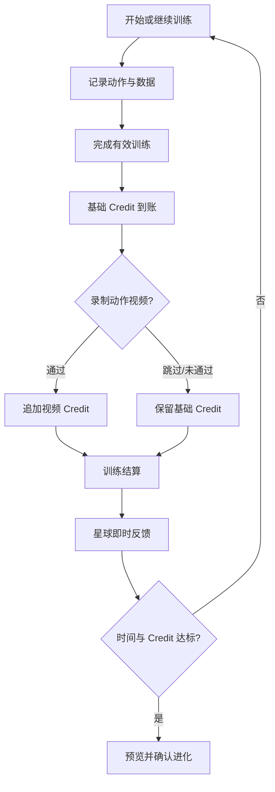
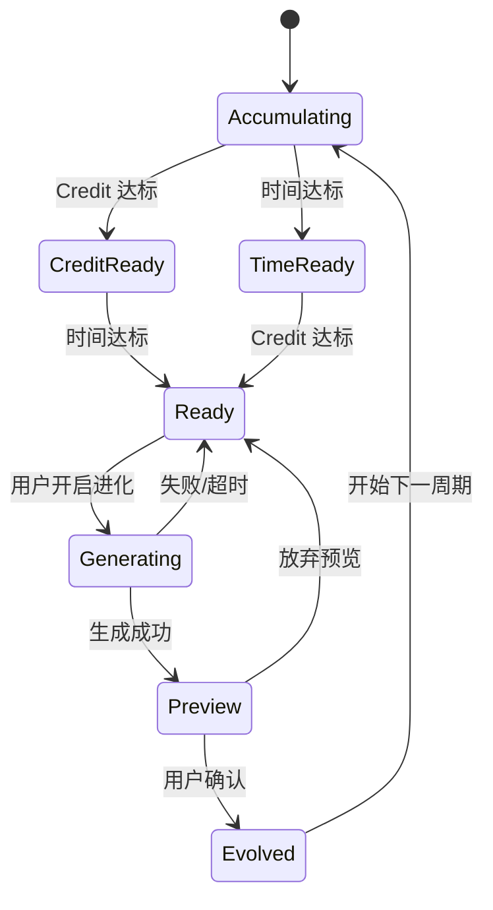

# Portal Fitness MVP 产品方案

> 版本：1.0  
> 更新日期：2026-09-15  
> 状态：产品、设计和研发的唯一规则源（Single Source of Truth）

## 1. 一句话定义

Portal Fitness 是一款手机端游戏化健身记录 App：用户完成真实训练获得 Credit，Credit 在满足时间条件后驱动个人星球进化，让训练成果变成可见、可积累、可回顾的长期资产。

## 2. 产品目标

MVP 要验证三个假设：

1. 星球成长能否提高用户记录训练和回到 App 的意愿。
2. 完整的训练记录能力能否支撑日常使用，而不只是一段概念演示。
3. 可选的视频核验奖励能否增加训练仪式感，同时不阻断核心训练闭环。

北极星指标是**每周完成至少一次有效训练的用户数（WAU-T）**。

## 3. 核心产品原则

- 训练记录是产品底盘，星球养成是持续反馈。
- 完成有效训练即可获得基础 Credit；视频核验只提供额外奖励。
- 每次训练提供即时视觉反馈，永久地貌按阶段集中进化。
- 星球变化必须可解释、可预览、可追溯，生成失败不得扣除 Credit。
- 训练、体成分和视频数据分层授权；AI 不输出医疗诊断。
- 关键规则由服务端按版本配置，客户端不得自行决定奖励结果。

## 4. MVP 范围

| 模块 | MVP 必须完成 | MVP 暂不包含 |
| --- | --- | --- |
| 账户 | 手机号/邮箱注册登录、验证码、协议确认、退出登录 | 社交登录、家庭账号 |
| 新手引导 | 基础资料、训练目标、训练条件、身体限制、星球命名和初始创建 | 长问卷、付费分层 |
| 训练记录 | 快速训练、结构化记录、草稿、完成结算、历史详情 | 直播课程、教练市场 |
| 动作库 | 搜索、筛选、收藏、最近使用、265 个已有动作/项目 | 用户公开视频社区 |
| 训练方案 | 创建、编辑、复制、删除、执行；AI 生成后可编辑 | 自动周期化高级编排 |
| Credit | 签到、训练、视频奖励、明细、封顶、幂等结算 | 付费购买 Credit、转赠 |
| 星球 | 首页、即时反馈、进化门槛、预览、确认、版本历史 | 社交访问、交易和排行 |
| 视频核验 | 录制/上传、画面可用性、动作周期、基础评分、重录/跳过 | 医疗诊断、康复处方、专业比赛裁判 |
| 数据 | 周摘要、体成分手动录入、隐私授权、删除/导出入口 | 穿戴设备全量接入 |

## 5. 目标用户与核心任务

### 5.1 目标用户

- 刚开始规律训练，需要即时反馈的新手。
- 已有训练习惯，但不愿使用复杂专业工具的普通健身用户。
- 同时进行力量、跑步、游泳、登山等多种运动，希望统一记录的人。

### 5.2 用户要完成的事

1. 用尽量少的步骤记下一次真实训练。
2. 快速找到适合自己的动作并组成训练方案。
3. 清楚知道本次训练获得了什么、为什么获得。
4. 看到身体与训练积累如何持续改变星球。
5. 自主决定是否上传视频，以及是否保留相关数据。

## 6. 信息架构

底部导航固定为四个一级入口：

| Tab | 职责 | 主要二级页 |
| --- | --- | --- |
| 星球 | 今日反馈、Credit 进度、进化和星球版本 | 每日额度、3D 全览、进化门槛、进化预览、版本历史 |
| 训练 | 开始或继续一次训练 | 动作库、训练记录、训练完成、视频核验、结算 |
| 方案 | 管理并执行训练方案 | 方案详情、方案编辑、AI 生成 |
| 我的 | 身份、数据、历史和设置 | 训练历史、Credit 明细、体成分、隐私与数据管理 |

动作库属于训练流程；训练历史属于“我的”。进行训练、录制视频和星球进化时隐藏底部导航。

## 7. 核心闭环

## 8. 新手流程

注册/登录 → 基础资料 → 目标与限制 → 训练条件 → 星球命名 → 初始生成 → 星球首页。

| 步骤 | 必填项 | 可选项 | 规则 |
| --- | --- | --- | --- |
| 账户 | 手机号或邮箱、验证码、协议确认 | 营销授权 | 验证码有频控；协议与隐私授权分开 |
| 基础资料 | 昵称 | 性别、出生年份、身高、体重 | 可选字段允许跳过，后续在“我的”补充 |
| 目标与限制 | 主要目标、每周频次 | 可用器械、训练经验、疼痛/限制部位 | 限制仅用于筛选动作与计划，不做疾病推断 |
| 星球创建 | 星球名称、初始气候种子 | 主题色 | 名称可改；初始种子确定视觉起点，不影响积分公平性 |

完成初始星球后立即进入首页。首日通过签到与一次有效训练即可接近或达到首次进化，避免用户等待一周才看到养成结果。

## 9. 训练系统

### 9.1 训练入口

- **快速开始**：创建空白训练，随后添加动作。
- **今日方案**：按方案预填动作、组数和目标值。
- **继续训练**：存在未结束草稿时置顶展示，并显示最近保存时间。

同一账户同时只允许一条进行中训练。再次开始时，用户必须选择继续或结束当前草稿。

### 9.2 记录模型

| 类型 | 必填记录 | 可选记录 | 有效训练最低条件 |
| --- | --- | --- | --- |
| 力量 | 动作、完成组、重量或自重、次数 | RPE、备注 | 至少完成 1 组，且次数大于 0 |
| 距离 | 项目、距离、时长 | 配速、心率、路线备注 | 距离与时长均大于 0 |
| 游泳 | 距离、时长 | 趟数、泳姿、泳池长度 | 距离与时长均大于 0 |
| 时长 | 项目、时长 | 强度、备注 | 达到该项目配置的最低时长 |

保存草稿不产生 Credit。点击“完成训练”后先进行有效性校验，再生成不可变的训练结算快照。

### 9.3 动作库

`src/exerciseLibrary.ts` 是当前动作数据源，历史与方案只保存稳定动作 ID。每个条目至少包含名称、别名、运动分类、主要部位、器械、记录模型、计分参数、视频识别支持状态、推荐拍摄角度和最低动作周期。

搜索范围包含名称、别名、肌群、器械和运动类型；默认排序依次为最近使用、收藏、名称匹配度。

### 9.4 训练方案

方案包含名称、目标、周频次、动作顺序、目标组次/距离/时长和备注。AI 生成方案时必须：

1. 使用相同的可编辑方案数据结构。
2. 生成前读取目标、频次、器械和身体限制。
3. 生成后执行动作存在性、单次总量、周频次和限制条件校验。
4. 用户确认保存后才能成为正式方案。

## 10. Credit 系统

### 10.1 默认规则

| 来源 | 奖励 | 条件 |
| --- | ---: | --- |
| 每日额度 | +5 | 每个账户每自然日一次 |
| 有效训练 | 最低 +20，单次最高 +120 | 训练有效且首次成功结算 |
| 视频通过 | +15 | 画面可用、动作匹配、达到基础奖励标准 |
| 每日总上限 | 200 | 超出部分不入账，结算页明确说明 |

具体训练奖励由服务端按运动类型、完成量和规则版本计算。客户端只展示服务端结算结果。

### 10.2 账本规则

- 每次入账形成不可变 `credit_transaction`，包含来源、关联对象、规则版本和创建时间。
- `workout_id + reward_type` 组成幂等键，重复提交不能重复发奖。
- 视频失败、低置信度、超时或跳过，只影响视频加成。
- 删除训练记录时保留审计账本，并按产品规则创建冲正记录，不直接修改历史金额。
- Credit 分为“总累计”和“当前可用”；进化消耗当前可用，总累计用于成就展示。

### 10.3 结算顺序

1. 校验训练有效性并锁定训练快照。
2. 计算并发放基础训练 Credit。
3. 展示基础奖励已到账。
4. 用户选择录制、上传或跳过视频。
5. 视频通过后追加 +15；其他结果保持当前余额。
6. 生成最终结算页，并检查进化是否就绪。

## 11. 星球养成

### 身体指标与地貌对应

星球首页使用统一球面地形表达身体指标，并沿用稳定区域 ID 供训练与后续身体数据接入：

| 区域 ID | 身体指标 | 地貌表达 |
| --- | --- | --- |
| `muscle` | 骨骼肌量 | 起伏山势、山脊、高原与裸露岩层 |
| `water` | 体内水分比例 | 大洋范围、海面流场与水系；“天脉长河”的动画是血液循环的视觉隐喻，不代表实际血流测量 |
| `bone` | 骨量 | 冰原起伏、冰脊、裂隙与冰川峡湾 |
| `fat` | 体脂率 | 季风林海、干湿边界与赤砂荒原的植被/裸地分布 |

当前前端显示值仍是示例数据。地貌用于解释身体指标与训练积累，不构成测量或医疗判断；真实身体数据接入后沿用上述区域 ID 和卡片字段。

### 11.1 两类反馈

- **即时反馈**：训练完成后出现能量注入、星核发光、临时地貌虚影；不改变永久资产。
- **永久进化**：Credit 与最短时间同时达标后，由用户主动开启并确认保存。

### 11.2 进化门槛

| 进化次数 | 最短间隔 | 消耗 Credit | 目的 |
| --- | ---: | ---: | --- |
| 首次 | 当天 | 60 | 首日看见成长结果 |
| 第二次 | 3 天 | 160 | 建立短周期期待 |
| 第三次 | 5 天 | 240 | 逐步拉长节奏 |
| 稳定期 | 7 天 | 320 | 形成周循环 |

间隔从上一次永久版本确认时间起算。两个条件独立显示：积分不足展示差额，时间未到展示剩余时间。

### 11.3 AI 生成边界

采用“确定性规则 + AI 生成资产”的混合方式：

1. 汇总本周期力量、有氧、恢复、签到和体成分贡献。
2. 规则层决定地貌类别、变化幅度、可修改区域和安全上限。
3. AI 基于父版本生成高度图、纹理或受控参数。
4. 客户端渲染预览，用户确认后写入新版本并扣除 Credit。

每个 `planet_version` 保存父版本、生成种子、模型版本、输入贡献快照、参数、资源地址和确认时间。原始训练视频不作为星球生成输入。

### 11.4 失败与并发

- 生成失败或超时不扣 Credit，并允许稍后重试。
- 生成期间新增的训练 Credit 进入下一周期，不改变当前生成输入。
- 同一星球同时只能存在一个生成任务。
- 用户放弃预览不扣 Credit；重新生成次数可由服务端配置。

## 12. 视频动作核验

### 12.1 产品定位

视频是训练后的可选加成，不是完成训练的必要条件。核验结果使用“通过 / 低置信度 / 画面不可用”三态，避免给出医疗意义上的“姿势正确或错误”。

### 12.2 MVP 链路

录制或上传 8–15 秒视频 → 提取人体关键点 → 判断画面可用性 → 判断目标动作与动作周期 → 规则评分 → 置信度门槛 → 返回结果。

推荐端侧使用 MediaPipe Pose 或 MoveNet 提取关键点；服务端接收骨架时序及完成判断所需的低清片段。首版只开放具备稳定识别规则的动作白名单。

### 12.3 结果处理

| 结果 | 奖励 | 展示 | 后续操作 |
| --- | ---: | --- | --- |
| 通过 | +15 | 完成周期、幅度/稳定性等 2–3 条可解释反馈 | 进入结算 |
| 低置信度 | +0 | 说明遮挡、角度或样本不足 | 重录或跳过 |
| 画面不可用 | +0 | 说明距离、光线、多人入镜等原因 | 重录、相册选择或跳过 |
| 分析失败/超时 | +0 | 明确基础奖励不受影响 | 后台重试或跳过 |

原视频默认在 72 小时内自动删除；历史保留需要单独授权。用户可以撤回授权并删除数据。

## 13. 核心数据对象

| 对象 | 关键字段 |
| --- | --- |
| `user_profile` | 用户 ID、昵称、目标、频次、器械、限制、授权版本 |
| `workout` | ID、状态、开始/结束时间、来源方案、项目明细、结算快照 |
| `workout_plan` | ID、名称、目标、频次、动作编排、生成来源、版本 |
| `exercise` | 稳定 ID、分类、别名、部位、器械、记录模型、识别配置 |
| `credit_transaction` | ID、类型、数值、幂等键、关联对象、规则版本、时间 |
| `planet` | ID、名称、气候种子、当前版本、可用 Credit、进化次数 |
| `planet_version` | 父版本、输入快照、生成种子、模型版本、参数、资产、状态 |
| `video_check` | 训练 ID、动作 ID、授权、分析状态、置信度、结果、删除时间 |

## 14. 数据、隐私与安全

- 账户、训练、体成分、视频四类数据分别标记用途和保留周期。
- 相机、相册和健康数据按功能触发授权；拒绝后仍可使用基础训练记录。
- 用户可导出训练与 Credit 数据，可申请删除账号及相关个人数据。
- AI 反馈不提供诊断、治疗、药物或康复处方。
- 疼痛和伤病信息只用于过滤动作、降低推荐训练量和显示就医提示。
- 风控需要识别重复视频、异常频率、极端训练量和重复结算请求。

## 15. 指标体系

| 阶段 | 指标 |
| --- | --- |
| 激活 | 注册完成率、初始星球创建率、首训完成率、首次进化到达率 |
| 训练 | 周有效训练次数、草稿恢复率、方案启动率、动作搜索成功率 |
| 养成 | 训练结算后返回星球比例、进化开启率、预览确认率、星球周访问频次 |
| 视频 | 入口曝光率、选择率、画面可用率、通过率、重录率、处理耗时 |
| 留存 | D1、D7、W4 留存，WAU-T |

## 16. MVP 验收标准

1. 新用户可完成注册、资料填写、星球创建并进入首页。
2. 用户可领取每日 +5，重复请求不会重复入账。
3. 四类记录模型均可完成训练、保存草稿和恢复草稿。
4. 训练完成后基础 Credit 先到账，视频跳过或失败不影响基础奖励。
5. 视频通过后只追加一次 +15，并能解释结果。
6. 进化页能分别处理积分不足、时间未到、已就绪、生成失败和确认成功。
7. 进化失败不扣分，确认成功只扣一次并创建可追溯版本。
8. 网络中断时训练草稿不丢失；恢复后能安全同步且不重复结算。
9. 用户能查看训练历史、Credit 明细、星球版本和数据授权状态。
10. 所有关键页面具备加载、空态、错误、重试和无权限状态。

## 17. 实施优先级

| 优先级 | 交付 |
| --- | --- |
| P0-1 | 账户、新手资料、四 Tab 外壳、星球首页、每日额度 |
| P0-2 | 统一训练草稿/结算、Credit 服务端账本、历史明细 |
| P0-3 | 视频核验白名单、三态结果、隐私和删除策略 |
| P0-4 | 进化门槛、生成任务、预览确认、版本历史 |
| P1 | AI 方案生成、体成分趋势、更多动作识别模型、穿戴设备接入 |

页面级操作、返回、异常和状态切换详见[手机端交互逻辑](interaction-spec.md)。动作与训练数据契约详见[动作库说明](exercise-library.md)。
