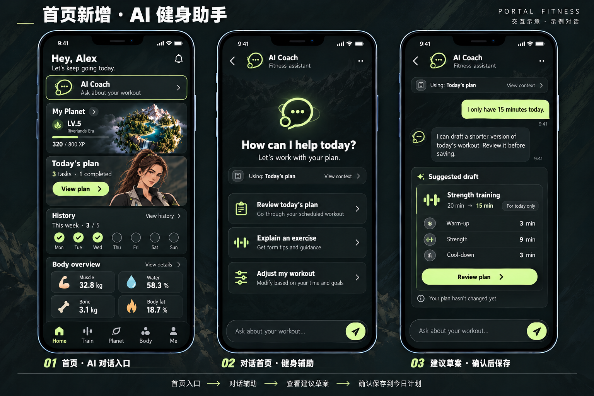

# AI 健身辅助 Agent：能力与计划草案

<!-- 2026-10-07：用户要求首页增加 AI 对话入口；明确对话、计划上下文、建议草案与用户确认流程。本轮仅设计概念与实施规范。 -->

<!-- 2026-10-08：入口改为五个主页面导航上方的统一横框，旧版首页顶部图保留作历史参考。 -->

入口与导航已更新为 [V5 四项主导航](../2026-10-11/README.md)：AI Coach 成为第四主页面，本页继续定义 Agent 能力与计划草案规则。下图为 10 月 7 日历史方案，首页顶部入口已被替代。

本图在 [首页 v2](README.md) 四个核心区域上增加 AI Coach 入口；计划展开/编辑继续沿用既有规范，训练启动按 [Train v2](TRAIN.md) 执行。AI Coach 是对话式健身辅助 Agent 的工作名，不是新的底栏标签或另一位人物角色。

## 1. AI 主标签与快捷入口（2026-10-11 更新）

Home / Train / Body Planet 三个主页面在四项导航上方显示 Ask AI Coach... 横框，点击切到第四项 AI Coach。直接点 AI 标签恢复同一对话，快捷入口可以关联当前页面主题；打开不自动发送问题。首页顶部旧入口移除。

AI 主页面只使用一个真实输入框，键盘关闭时保留四项导航，键盘打开时导航临时收起。切页保留消息、草稿及原页滚动/相机/会话；不会启动或结束训练。Body 与 Planet 已合并，上下文来源统一为 From Body Planet；额外身体数值按需加入。首页和训练的搭档插画继续保留，融合页人物仅位于下方身体分析卡，球体视口没有头像。

## 2. 对话与 Agent 能力

| 状态 / 能力 | 内容与操作 | 目标结果 |
| --- | --- | --- |
| 首次进入 | AI Coach，简短欢迎；Review today's plan / Explain an exercise / Adjust my workout 快捷问题 | 点击先填入输入框，用户确认发送；底部真实输入框与发送按钮 |
| 可用上下文 | From 当前页面，可查看已选择上下文 | 按来源关联计划、动作或选区；身体数值可另行加入，缺失时补问信息，不编造记录 |
| 对话 | 用户消息、AI 回复、生成状态 | 连贯回答训练流程、动作说明、训练安排与记录回顾；根据问题请求缺失目标/经验/时间等信息 |
| 调整建议 | 将 20 min 改为 15 min 的示例草案卡，标记 Suggested draft，Review plan | 生成结构化草案并预览前后差异，不直接改写今日计划 |
| 确认 | 预览页面 Save to today / Cancel | 校验后用户显式保存才发布当日新版本；取消原计划不变，已开始会话不追溯修改 |
| 错误与重试 | Couldn't send / Retry；保留输入与已有消息 | 网络或服务失败不显示伪造回答或成功；重试不重复提交或重复写入计划 |
| 未接入服务 | 明确 Preview / unavailable 状态 | 静态示意和演示回复不包装成真实 Agent；不可用操作禁用并说明 |

Agent 可辅助理解动作、查看计划、整理可用训练时间、提出可执行草案。解释和建议不自动记录训练完成、不启动计时、不发奖励。只开放已经实现且有可靠数据源的工具；例如 read_today_plan / draft_workout_plan / preview_plan_changes / save_today_plan，最后一步必须来自用户明确点击确认。

缺少身体记录时不猜测数值；只有明确需要时才选择额外上下文，并展示范围。回复需要区分用户记录、计划目标与助手建议。身体不适或诊断类问题不能以聊天推断疾病，需按实际情况建议寻求专业评估；不在普通流程铺设长免责声明。

## 3. 计划与会话一致性

草案包含目标日期、基于的计划版本、支持的动作 ID、阶段时长、组次或时长目标以及修改摘要。保存前检查动作是否在库中、类型/单位/数值有效、阶段与目标总时长一致、原版本是否已变化。

20→15 分钟只是界面说明，生成图不定义训练剂量。阶段重分配与动作调整必须由已确认的计划规则处理；缺少规则时只可给文字建议，不启用保存按钮。计划版本变化时刷新差异供再次确认，不覆盖用户刚保存的编辑。对话重试、重复点保存和刷新不能生成多份同样的计划。

输入、对话历史、计划草案和真实 workoutSession 分开管理。对话页返回不会启动或结束训练。进行中快照保持不变；保存的草案仅作用于指定日期的未开始计划。长对话可恢复/清除范围须在实现时明确；无云同步时不宣称跨设备恢复。

## 4. 实施需求 G-AI-COACH

Codex 按此规范推进 UI 与功能实现。本轮产物为静态视觉图、提示和设计说明；没有接入模型服务或修改运行代码。

- 四项导航中的 AI 主标签、前三页快捷横框、共享对话、来源上下文与切页恢复；320/390/430px、键盘、安全区、输入框和长消息布局。
- 真实消息状态：发送中/生成中/完成/停止/错误/重试；去重、输入保留、自动滚动与用户上翻互不冲突。
- Agent 服务契约与受控计划工具；服务密钥保留在服务端，客户端只访问应用后端，不新增写死密钥。
- 展示已使用上下文和数据来源；空计划/空记录不编造，示例回复标记为示例。
- 草案预览→确认→可靠保存；类型校验、计划版本冲突、重复提交、失败保留和进行中快照隔离。
- 真实联调后更新产品/现状交互/变更记录，并提供首页、对话和计划确认的浏览器证据。后端、模型和存储方案在功能实施前确认，不由概念图推定已存在。

生成方式：内置 imagegen，首页原图为风格与布局参考；人物沿用都市美漫轻度写实。提示见 [PLANET-AI-PROMPTS.json](PLANET-AI-PROMPTS.json)。

<!-- 2026-10-11：AI 独立主页面取代原 Me 入口；主页导航与键盘规则以 V5 为准。 -->
