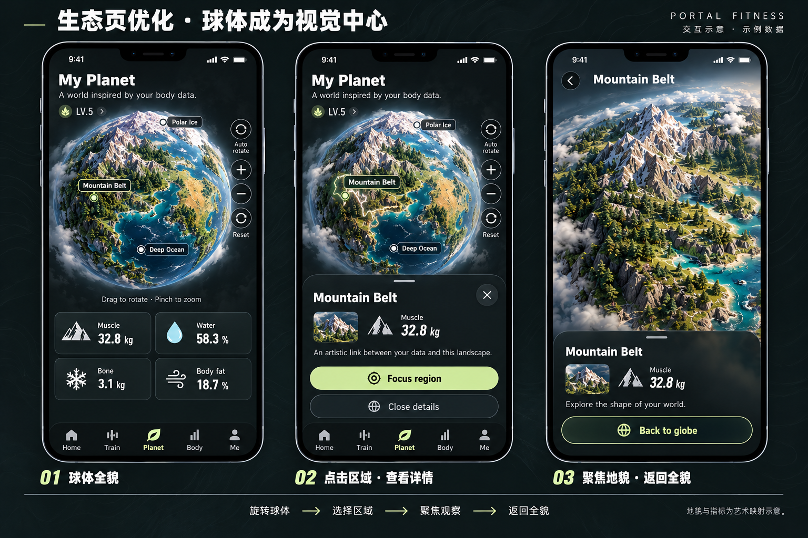

# 生态页 v2：以球体和地貌为中心

> 导航与布局更新：以 [V5 四项导航与 Body Planet 融合](../2026-10-11/README.md) 为准。原独立 Planet 合并进 Body Planet，球体视口仍不放人物；身体透视位于下方分析卡，旧图仅作球体与操作参考。

<!-- 2026-10-07：按用户要求移除生态页中间人物头像，优化球体、区域详情和聚焦视图。本轮交付静态设计，运行接入另行实施。 -->

本图替代 [上一版生态交互图](../2026-10-06/03-planet-explore-region-states-v1.png) 的就绪/选区/聚焦构图；加载、失败、无指标状态仍按 [页面交接](../../design/PAGE_CONTENT.md) 的规则实现。世界美术依据 [PLANET_ART.md](../../design/PLANET_ART.md)，首页与生态页复用同一地形源。

## 1. 球体中心区域

- 移除原 Look closer at your world 人物头像条；生态页不另放人物、陪伴半身或对话头像。首页与训练页已确认的搭档形象不受此修改影响。
- 全貌保留完整球形轮廓和连续海陆，以自然日光、岩层灰、森林绿、深蓝海面及青蓝浅海建立层次。暗色界面不能使球体本身过暗。
- 画布占首屏主要面积，区域名与标记数量受控；云层只在边缘少量出现，不遮挡选区。山脉、河谷、极地与干旱区有差异，避免整球全绿、尖峰密集或漂浮平面岛屿。
- 旋转/缩放/复位沿视口侧边排列，详情在底部；按钮不覆盖关键峰顶与标签。Drag to rotate · Pinch to zoom 只占一行。
- 四指标在球体下方两列排列，不另加人物提示条。缺失显示 —，不补伪造数值。示例值沿用 32.8 kg / 58.3% / 3.1 kg / 18.7%。

## 2. 区域交互

| 状态 | 画面与操作 | 目标行为 |
| --- | --- | --- |
| 全貌 | My Planet，大球，少量区域标记与侧边控件 | 拖动旋转，双指/滚轮缩放，Auto rotate、Reset 提供替代操作 |
| 选区 | Mountain Belt 细轮廓与标记，底部名称/对应指标 | 停止自转，显示真实保存值；Close details 返回全貌并清除选中 |
| 聚焦 | 同一山脉的轨道近景、岩层/河岸/林地细节 | Focus region 拉近同一地区，不切换种子或创建另一颗球；Back to globe 恢复全貌 |

指标与地貌说明使用艺术映射文案，不把地形读成身体诊断，不写未经定义的“数值越高山越高”。正常、选区和聚焦必须保持相同地理锚点；生成图的近景细节仅为概念，实际验收以同种子渲染截图为准。

## 3. 实施与验收 G-PLANET-v2

1. 移除生态页头像提示组件并回收空间；球体、数据和操作成为唯一信息层级。
2. 复用现有 renderer 与身体指标来源；首页预览只读，生态页负责旋转、拾取、聚焦、复位。
3. 区分短按与拖动；遮挡/背面标记不可点击。Close details 和 Back to globe 的关闭/相机恢复语义一致。
4. 检查 320/390/430px：球体轮廓完整、详情可滚动、安全区与底栏不遮住控件；减少动态效果时停止持续自转。
5. 加载依赖首帧 ready；错误有重试，无指标有录入入口。不能只以 iframe onLoad 判定画面已就绪。
6. 提交全貌/背面/选区/聚焦的实际截图，明确静态设计与运行状态。当前 PNG 不构成已实现或视觉验收通过。

生成方式：内置 imagegen；上一版生态图与最新首页原图仅作功能/风格参考。提示见同目录 [PLANET-AI-PROMPTS.json](PLANET-AI-PROMPTS.json)。
