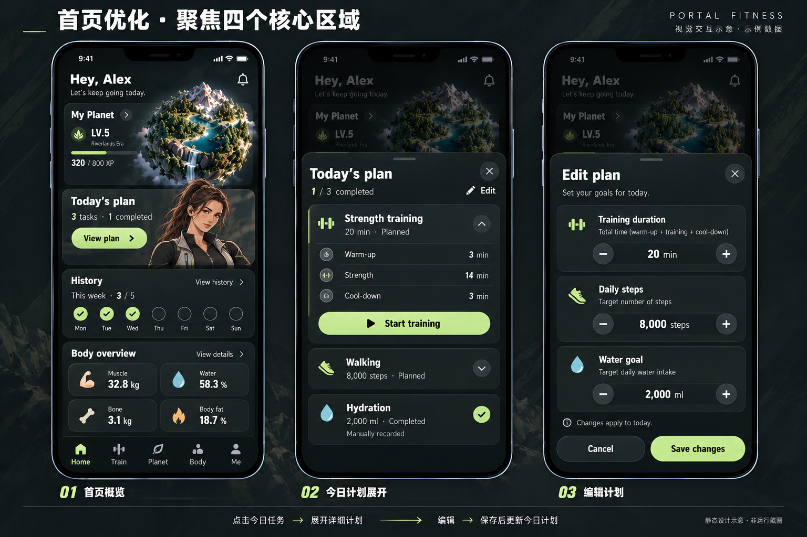

# 最新首页视觉与交互交接 · 2026-10-07

<!-- 2026-10-07：ChatGPT 按用户提供的最新首页原图更新设计基准，并将功能实现要求交接给 GLM。 -->

来源：用户提供的原始 PNG，原样保存。本图替代 [上一版首页图](../2026-10-06/01-home-navigation-tasks-v1.png) 的首页布局与计划交互；Train 已更新为 [两种训练入口 v2](TRAIN.md)；上一版 Planet / Body / Me 图继续作为参考。完整页面交接见 [PAGE_CONTENT.md](../../design/PAGE_CONTENT.md)。本次只更新设计资产与说明，未将图片或交互接入运行代码。

## 视觉基准与首页结构

沿用都市美漫与轻度写实人物、暗黑运动科技氛围、黄绿色主操作，强调陪伴感与克制的潮流感。人物为原创插画搭档，避免真人、过度萌化或怪诞化。主页只保留四个核心区域：

| 区域 | 内容与入口 | 目标交互 |
| --- | --- | --- |
| My Planet | LV.5 / Riverlands Era / 320 of 800 XP，小球与进入箭头 | 卡片入口进入 Planet；小球本身为只读预览 |
| Today's plan | 3 tasks · 1 completed，搭档半身，View plan | 展开今日计划底部面板，不启动训练 |
| History | This week · 3/5，七日完成标记，View history | 打开训练历史；历史页面细节另行设计，不能保留无反馈入口 |
| Body overview | Muscle / Water / Bone / Body fat 四指标，View details | 进入 Body 查看已保存指标与身体分析示意 |

顶部保留问候，底栏保持 Home / Train / Planet / Body / Me。图中通知铃的目的与实际通知能力尚未定义，实现前需确定或取消可点击外观。首页不再单列旧版长任务列表、训练菜单和独立 XP 模块；XP 合并到星球卡，任务合并到今日计划。

## 今日计划与编辑流程

1. 点击 View plan，首页加遮罩，弹出 Today's plan；展示 1/3 completed、Edit、关闭按钮。
2. Strength training 默认展开：20 min · Planned；Warm-up 3 min / Strength 14 min / Cool-down 3 min。点击行右侧箭头折叠或展开；本轮训练页优化后，图中的 Start training 应改为 View workout：先进入训练计划内容，内容页的 Start planned workout 才开始。
3. Walking 展示 8,000 steps · Planned，可展开详情；图未定义其详情内容，不自行增加设备采集流程。Hydration 展示 2,000 ml · Completed，并标记 Manually recorded。
4. Edit 切换至编辑面板，建立独立草稿。Training duration / Daily steps / Water goal 各提供减、当前值、加；单位分别为 min / steps / ml。
5. Cancel 返回计划面板并丢弃草稿；Save changes 保存后返回计划面板、更新首页摘要。编辑面板关闭与取消保持同样语义。计划面板关闭回到首页；遮罩或系统返回如支持，也必须保持一致取消语义。

更改仅适用于当天，不修改长期模板、历史记录或其他日期。保存保留已完成任务与记录，不重复发放 XP；若目标调整影响完成状态，应先确定业务规则，不能静默重置。进行中的会话不被编辑追溯修改；重复开始须返回同一会话或明确阻止。

## 数据与待定规则

所有数字均为示例：Alex、Maya、LV.5、320/800 XP、3/5 周进度、32.8 kg 肌肉、58.3% 水分、3.1 kg 骨量、18.7% 体脂。它们不是实时测量或医疗结论。步数和饮水在未接入数据源时应标记为手动记录。

今日计划按本地日期独立保存；编辑草稿不污染已保存值。20 分钟包含热身、主训练和放松，图示分配为 3+14+3；这不替换 Train 页既有三种训练模板的预设。调整总时长后的分配方法、数值步长和上下限、跨日规则、目标调整后完成状态的判定仍待确定，由 GLM 实现前补充规则。

## GLM 实施与验收

ChatGPT 负责此设计基准、视觉评审和美术资产；GLM 负责首页布局接入、计划展开/折叠、编辑草稿与保存、当日持久化、训练与历史数据联动。此文档为开发需求交接，尚未发送至其他聊天或启动功能开发。

- Home 四区域顺序、标签与主次关系符合原图；320/390/430px 宽度下内容、底栏和面板可读可操作。
- View plan 只展开；View workout 进入计划内容；显式 Start planned workout 才建立计划会话，时长与今日计划一致。
- 草稿调整后取消或关闭，旧值不变；保存成功后首页与计划同步，刷新后可恢复当天数据。
- 防重复提交；失败保留草稿与旧值，错误可读且可重试；本地保存不伪造网络状态。
- 完成状态、历史、周进度和 XP 同源，重复打开/保存/结算不重复奖励。
- 面板支持焦点管理、关闭后恢复焦点、安全区与背景滚动锁定；图中文字不能作为整张图片代替实际控件。
- 实现完成后更新现状交互、资产索引和变更记录，并提供实际浏览器截图；这张示意图不构成运行验收。

<!-- 2026-10-07：按用户训练页新要求同步入口语义；首页原图保留，实施文案由 Start training 改为 View workout。 -->
