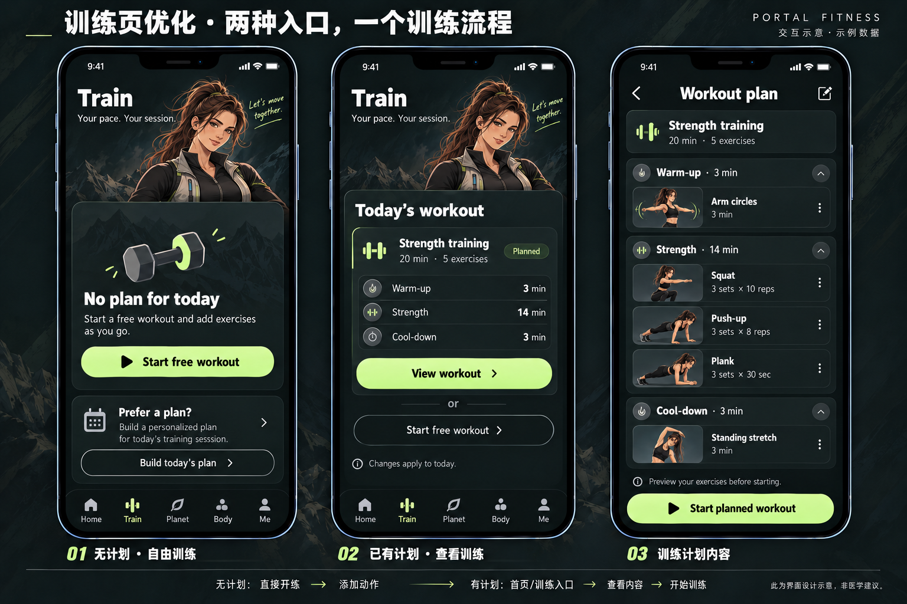
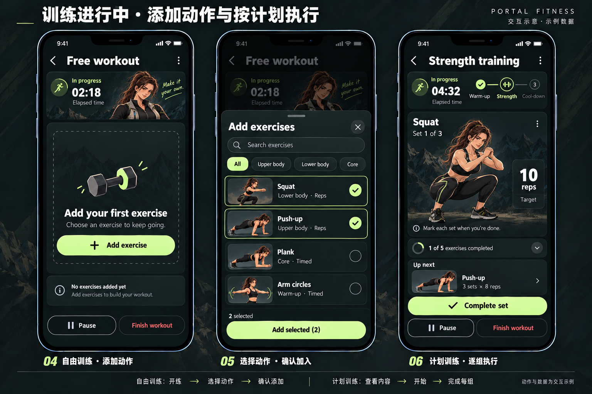

# 训练页 v2：自由训练与计划训练

> 导航与布局更新：以 [V5 四项导航与 Body Planet 融合](../2026-10-11/README.md) 为准。训练两条业务流程沿用本文，原图的五项底栏替换为 Home / Train / Body Planet / AI Coach。

<!-- 2026-10-07：ChatGPT 按用户新需求重规划训练页；功能代码列为后续实施需求，本轮不修改运行实现。 -->

承接 [最新首页](README.md) 的训练模块，沿用暗黑、黄绿色主操作、都市美漫与轻度写实运动搭档。训练内容优先，搭档只提供少量陪伴提示。新流程替代上一版以三种模式卡片为主的 Train 入口；旧模式可作为后续计划模板，不再构成训练页必须选择的一步。

## 1. 两种入口

| 入口状态 | 页面内容 | 主操作与结果 |
| --- | --- | --- |
| 当天没有可执行计划 | No plan for today，说明可边练边加动作，搭档提示 | Start free workout：直接建立自由会话并开始计时，随后添加动作；不强制先创建计划 |
| 当天有可执行计划 | Today's workout，计划名称、总时长、动作数、热身/主训练/放松摘要 | View workout：进入计划内容预览，不启动计时；另提供次级自由训练入口 |
| 已有进行中或暂停会话 | 显示当前会话状态与 Resume workout | 恢复同一 sessionId；两类入口均不创建第二个会话 |

进入 Train 标签本身不启动训练。有计划用户仍可选自由训练；自由记录不自动当作完成指定计划。无计划卡上的 Build today's plan 为后续可选设计入口，其编辑流程需单独设计；未实现时不开放空点击控件。

## 2. 首页入口统一

用户本轮要求“点击训练后，进入训练计划内容”，因此首页上一版 Start training 按钮应改为 View workout。Home → View plan 仍只展开当天任务；训练项的 View workout 跳转 Train 的计划内容页，保留返回来源。

计划内容显示 Strength training / 20 min / 5 exercises，按 Warm-up 3 min、Strength 14 min、Cool-down 3 min 分组列出动作。每项展示名称、小型动作示意、目标组数与次数或时长。底部 Start planned workout 是显式开始入口。浏览计划、点开动作说明、切换页面均不建立会话。

图中的五动作（Arm circles、Squat、Push-up、Plank、Standing stretch）与组次仅为 UI 演示，不构成个性化训练建议或正式动作库。20 分钟是目标总时长；主训练组次不能自动推算为精确 14 分钟。实际执行时长按会话记录，时长分配算法另定。

## 3. 自由训练：开始 → 添加动作 → 执行

1. Start free workout 建立 `source=free` 的会话，进入 Free workout；计时从显式点击开始。
2. 初始无动作：显示 Add your first exercise 与 Add exercise，不填伪造动作/进度。
3. Add exercise 打开动作选择面板：搜索、简单部位/类型筛选、名称与示意、勾选状态、Add selected。搜索与筛选只影响列表。
4. 选择存在独立草稿；取消、关闭或返回丢弃未确认选择。Add selected 把选中动作一次性加入当前会话并返回；无选择时禁用。动作库缺失/加载失败提供明确状态，不以图片代替可用列表。
5. 加入后可编辑组数、次数或时长，并按当前顺序执行；次数型与时长型字段分开。用户标记完成，未接入识别设备时不自动宣称动作完成。
6. 过程中可继续 Add exercise。已经记录的组保留；删除有记录的动作需确认并保留记录的追溯关系，不静默删除完成数据。

打开动作选择面板不自动暂停总计时；用户主动 Pause 才暂停。关闭面板返回原会话与原进度。自由会话刚开始可无动作，但空会话不计入完成次数或发奖励；结束时提供 Discard workout / Keep training。

## 4. 按计划训练：预览 → 开始 → 按顺序执行

Start planned workout 建立 `source=plan`、绑定 `planId` 和 `planVersion` 的会话快照。显示当前阶段、当前动作、当前组、目标次数/时长、下一动作与整体进度。主操作为 Complete set，完成组后进入休息或下一组，最终进入下一动作；Pause / Resume 沿用同一会话。休息时长和阶段切换规则另定。

计划默认保持既定顺序。动作详情查看不算完成；缺少动作数据时阻止开始并显示修复入口。有进行中会话时先恢复它。修改当天计划只影响未开始的计划，不追溯改动进行中的快照。跳过动作须显式记录为 skipped，不能等同完成全部计划。

Finish workout → 确认结束 → 结算。提前结束记录为 partial，空会话丢弃；完整完成才按确认后的业务规则标记计划完成。自由训练与计划训练复用执行和结算组件，但保留各自来源。完成判定、XP、周统计是否纳入部分训练均待确定；不能照示意图硬编码奖励。

## 5. 开发实施清单 G-TRAIN-v2

Codex 统一负责交互图、说明文档及动作库、会话、计时、计划快照、保存与首页联动的实现。本轮仅完成设计说明，尚未修改相关运行代码。

建议数据：`dailyWorkoutPlan(date, planId, version, phases, exerciseIds, targets)`、`exerciseCatalog(id, name, type, illustration, instructions)`、`workoutSession(sessionId, source, planSnapshot, status, accumulatedTime, startedAt)`、`exerciseLogs(sessionId, exerciseId, sets, completed/skipped)`。同日饮水/步数任务不混入动作列表。

| 验收情景 | 应有结果 |
| --- | --- |
| 无计划进入 Train | 展示自由训练入口；进入标签不计时，点击主按钮后计时 |
| 自由训练添加/取消 | 确认后动作加入当前会话；取消旧列表不变；再次点击不重复插入 |
| 有计划进入 Train / 从 Home 进入 | 前者展示当天摘要；后者直接打开对应内容；均未计时 |
| 计划预览后开始 | 仅显式开始建立一次会话，按绑定计划版本执行 |
| 标记组、休息、暂停、恢复 | 用户日志和计时一致，组目标次数/时长清晰，重复完成不重复写入 |
| 切页、刷新、跨日 | 不建立第二会话；恢复当前会话；跨日不把旧计划绑定到新日期 |
| 部分结束/空会话/完整完成 | 状态区分明确，记录与奖励不重复；计划完成只依据确认的规则 |
| 保存失败 | 保留已有训练记录并可重试，首页不先显示成功 |
| 320/390/430px 与弹层 | 内容可滚动，按钮在安全区，焦点恢复，背景滚动锁定，Train 高亮 |

## 6. 图册与生成信息

两张图分别展示入口/预览和自由执行/动作选择/按计划执行。由内置 imagegen 生成，首页原图仅作风格参考；它们是静态交互概念，尚未获用户视觉确认，也不是实际运行截图或动作指导素材。完整生成提示保存到同目录 `TRAIN-PROMPTS.json`；原始生成文件保留，项目引用使用本目录副本。
