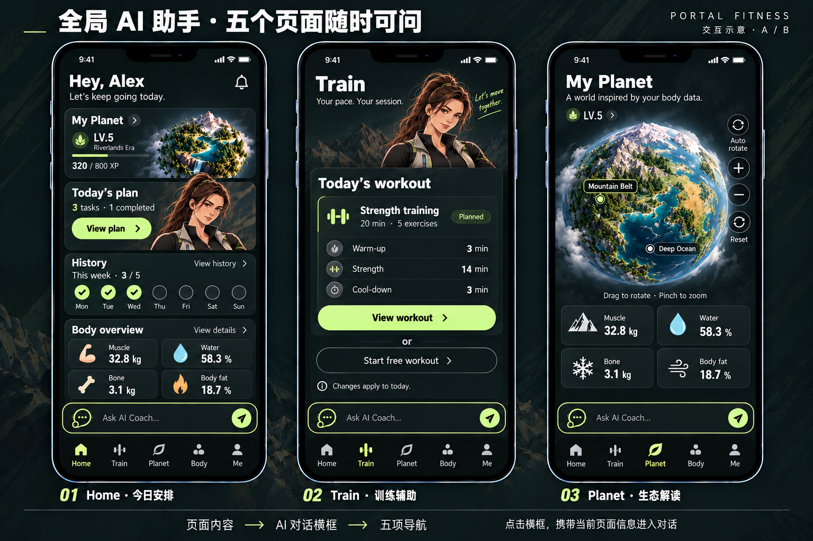
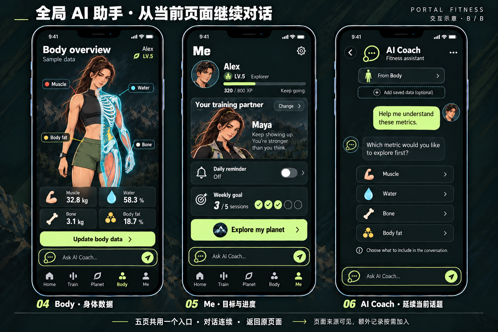

# 全局 AI Coach 横框 · 2026-10-08

<!-- 2026-10-08：根据用户“每个页面的导航栏上方增加快捷 AI 对话横框”的偏好，统一五页入口，替代仅首页顶部入口。静态视觉与交互规范，尚未接入运行。 -->

本轮采用共享底部 AI 横框：Home / Train / Planet / Body / Me 五个主页面都可以直接进入同一个 AI Coach。保留现有五项导航；AI 作为跨页辅助入口，便于围绕正在查看的内容提问。它替代 [10 月 7 日首页顶部 AI 入口](../2026-10-07/HOME-AI.md) 的位置设计，沿用已有对话与计划草案规则。

## 1. 布局

从上到下固定顺序：页面内容 → AI 横框 → 五项导航 → 底部安全区。

| 项目 | 目标规格 / 规则 |
| --- | --- |
| 横框高度 | 52px，触控高度至少 44px；窄屏保持可读，不缩成小图标 |
| 左右边距 | 与页面卡片对齐，基准 16px；上/下间距各 8px |
| 外观 | 深色实底、克制的浅绿色描边、抽象对话图标；不使用人物头像 |
| 文案 | 五页统一 Ask AI Coach...，右侧进入箭头；不伪装未读通知 |
| 页面主操作 | View plan / View workout / Update body data 等仍优先使用醒目的实色按钮；横框采用低强调样式 |
| 底部区域 | 放入共享页面外壳的独立两行布局；导航安全区只计算一次 |
| 内容空间 | 为完整底部区域预留高度，内容可滚动；最后一张卡、页面主按钮和球体控件不能被覆盖 |

首页顶部原 AI 卡片移除，只保留这一个统一入口。生态页不放人物头像，横框仅使用抽象 AI 图标；球体仍为页面中心。Body 继续采用已确认的半边透视示意；本轮不新增身体分析能力。

## 2. 点击与输入

横框是进入共享对话页的快捷入口，点击任意位置或右箭头进入 AI Coach 并聚焦真实输入框。主页面入口实现为有可访问名称的按钮，避免将不可编辑的假文本框暴露为输入控件；真实输入、键盘、发送和生成状态集中在对话页。

打开对话不自动发送问题。快捷问题统一先填入输入框，用户确认发送后生成回复。保留一个对话状态与未发送草稿，五个入口不各自建立孤立聊天。返回回到来源页、原滚动位置、原选择和原训练状态。

独立对话页使用一个真实 composer；不重复绘制快捷横框。当前方案对话页隐藏主导航，以返回按钮回原页；正在生成时可停止，退出后保留已有消息。来源页的训练会话继续按原有规则计时，进入对话不等同 Pause、Finish 或完成任务。

## 3. 页面上下文

| 来源页 | 初始主题信息 | 可提出的问题 |
| --- | --- | --- |
| Home | 当天计划入口及已关联的计划摘要 | 今天的安排是什么？如何调整可用时间？ |
| Train | 当前查看的计划/动作标识或会话状态 | 解释这个动作；查看计划；形成调整草案 |
| Planet | 当前选区与地貌名称；全貌时只提供页面主题 | 解释这一区域与已定义艺术映射的关系 |
| Body | 当前指标名称；已保存数值可另行加入 | 了解指标含义；在用户选择后回顾保存记录 |
| Me | 用户选择提供的目标或周进度 | 回顾完成情况；讨论后续安排 |

对话顶部显示 From Home / From Train / From Planet / From Body / From Me，并提供可查看的上下文。入口切换只更新新问题所用的来源，不改写过去消息的上下文；已有草稿不因跨页丢失。额外身体记录由用户选择加入，缺失数据不得推测或从人物/球体外观反推。

从 Body 进入的示例使用 From Body 与 Add saved data 可选项，展示“先说明问题，再选需要的记录”的交互。图中数值与对话都是设计演示，不代表真实读取或模型回答。

## 4. 弹层、键盘与小屏

- 带五项导航的五个主页面都显示横框。训练进行中、数据编辑、计划详情等原本隐藏主导航的沉浸页沿用其专用控件，不额外悬浮全局底栏；返回主页面后横框恢复。
- 模态面板打开时，AI 横框和导航均属于背景层：不可点击、不可获得焦点，不能盖住 Save / Cancel。关闭后恢复原焦点。
- 对话键盘弹出时，composer 保持可见，消息区缩小并可滚动；使用实际可视视口处理，不能压住发送按钮。
- Planet 的画布高度根据可用内容区计算，侧边缩放控件在画布内部；不通过把球体压成很小的图标补足底栏高度。
- 在 320/390/430px 和横屏检查长文本、底部安全区与滚动终点；提示文案允许省略，主要控件名称保持可读。

## 5. Agent 行为与实施 G-AI-GLOBAL-v4

共享入口复用 [AI Coach 能力与计划工具规范](../2026-10-07/HOME-AI.md)。对话解释、生成草案、预览差异、用户确认保存保持独立；打开横框或收到建议不会直接改变当天计划、已开始会话、XP 和完成记录。

验收重点：

1. 五页均只有一个 AI 横框，宽度、高度、位置、图标和点击行为一致；底栏选中态正确。
2. Home 已移除顶部重复入口；Planet 没有人物头像或遮挡地貌的悬浮入口。
3. AI 横框不覆盖任何内容，最后一张卡与主按钮可以完整滚动到可视区域。
4. 五页来源可区分，返回路径正确；对话和草稿连续，切换来源不静默添加额外身体数据。
5. 空输入不能发送；模态背景控件禁用；键盘与发送区不互相遮挡。
6. 真实服务未接入时明确展示 Preview / unavailable；后续接入再验证发送、停止、失败重试及可靠保存。

本轮使用内置 imagegen 生成两张静态概念图，覆盖全部五页及对话页；生成提示与参考图索引见 [PROMPTS.json](PROMPTS.json)。图片已保存为项目资源，运行代码未修改，尚未进行实际浏览器验收。
