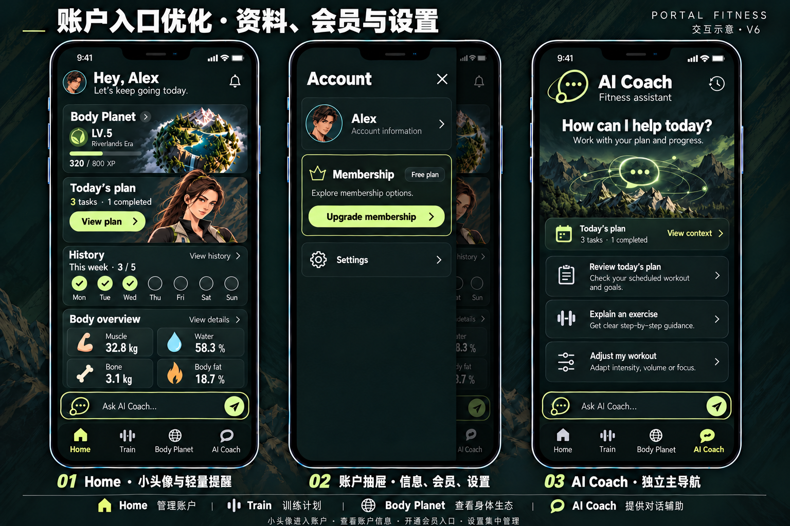
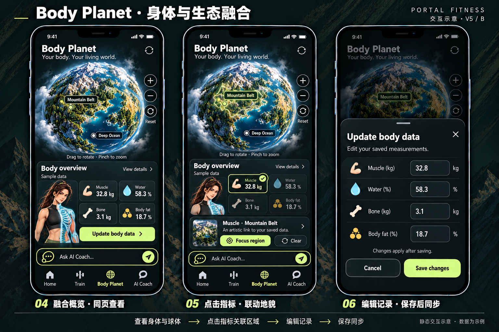

# 账户入口与会员抽屉 · V6 / Body Planet 融合 · V5

<!-- 2026-10-11：继续完成用户 10 月 8 日提出的 Body/Planet 合并、AI 替代 Me、账户迁入首页左侧抽屉要求。此版为目标设计；尚未接入运行代码。 -->
<!-- 2026-10-11 V6：缩小首页头像与通知铃，移除头像旁菜单标识；账户抽屉收为账户信息、会员开通入口、设置。 -->

## 1. 本版设计

底部导航统一为 **Home / Train / Body Planet / AI Coach**。Body 和 Planet 合并为一个主页面，原 Me 功能迁入 Home 左上角账户按钮打开的左侧抽屉，AI Coach 成为第四个主页面。本版取代 [V4 五项导航](../2026-10-08/README.md)；旧图保留用于追溯，不作为当前导航依据。

V6 更新首页顶部入口与账户抽屉；融合页继续使用 V5 设计。账户抽屉以账户信息、会员开通、设置为三项主内容，Weekly goal、搭档卡、提醒开关、等级与 XP 不再出现在抽屉首页。旧 [V5 账户图](01-home-account-ai-navigation-v5.png) 保留为历史参考，由 V6 覆盖。

Home、Train、Body Planet 保留导航上方的 Ask AI Coach... 快捷横框，点击切到第四项并聚焦输入。AI Coach 本页只放一个真实输入框，键盘关闭时四项导航可见。没有第五星球/身体/Me 标签，也没有重复的 AI 横框。

## 2. 页面与原入口迁移

| 入口 / 原功能 | 当前目标位置 | 到达后的状态 |
| --- | --- | --- |
| Home | 第一项 | 今日安排、训练入口、历史、身体摘要；左上账户按钮 |
| Train | 第二项 | 沿用无计划自由开练 / 有计划先预览再开始两条流程 |
| 原 Planet、首页星球卡、训练结算 Explore planet | 第三项 Body Planet | 融合页顶部球体概览；退出后保留相机与滚动位置 |
| 原 Body、首页身体卡 View details | 同一 Body Planet 页面 | 滚动到身体分析区域；若来自具体指标则选中该指标 |
| 原 Me 主导航位置 | 第四项 AI Coach | 同一对话与未发送草稿；直接点标签不自动新增上下文或发送消息 |
| 原 Me 账户资料、设置 | Home 左上小头像 → Account 左侧抽屉 | 账户信息入口、会员卡、Settings；保持首页为背景 |
| 会员付费入口 | 抽屉 Membership → Upgrade membership | 打开会员方案详情；查看后再选择方案与支付 |
| 等级 / XP、周训练进度 | Home 星球卡 / History | 不在账户抽屉重复展示 |
| 三页快捷 AI 横框 | 第四项 AI Coach | 关联来源页面/当前指标或动作主题；额外身体数值按需加入 |

路径名称可在实施时匹配实际路由，但旧 Body / Planet 入口最终必须落在同一融合页面。旧 Me 链接应导向 Home 的账户抽屉，不得误打开 AI。状态容器分别保存相机、选中指标、各页滚动位置、训练会话与对话，切换主导航不清空这些状态。

## 3. Body Planet：同页看身体与生态

融合概览采用一条连续内容流：标题 Body Planet → 完整球体 → 紧凑身体分析卡 → 数据更新入口。球体是主要视觉焦点；半边透视人物仅用于下方身体分析卡，不作为头像或陪伴条覆盖球体。身体分析卡左侧为小幅、正常成人比例的透视示意，右侧是 Muscle / Water / Bone / Body fat 四项数值；小屏可改为上下排列并自然滚动。

分析卡的 View details 展开同页指标说明或滚动到详细记录，不再跳往独立 Body 页面。球体标签与图示小图标按当前数据源显示。

不再用两个主标签或必须来回切换的 Body/Planet 子标签拆分原页面。球体全景、指标和身体图共同描述一份已保存数据，点击相互联动。

| 交互 | 页面反馈 | 状态要求 |
| --- | --- | --- |
| 点击 Muscle / Water / Bone / Body fat | 指标卡选中，对应地貌标记/语义层突出，显示解释详情 | 同时使用文字、图标和轮廓；不只靠颜色 |
| 点击球体区域 | 对应指标选中，显示同一份详情 | Muscle→山脉，Water→水域，Bone→极地，Body fat→气候；气候属于图层关系，不虚构固定脂肪大陆 |
| Focus region | 同一地形源的轨道聚焦 | 不切换种子或重建第二套球体；气候按图层或代表区域解释 |
| Close details / Back to overview | 关闭详情或恢复全貌 | 保留已保存指标；相机恢复规则一致 |
| Update body data | 打开四字段独立草稿 | 编辑期间不发布数据、不驱动球体变化 |
| Save changes | 校验通过后更新身体卡、区域详情与首页摘要 | 单一数据源；保存成功才生效，重复提交去重 |
| Cancel / 关闭 / 系统返回 | 丢弃未保存草稿，返回融合页原位置 | 相机、指标、已保存数据保持原状态 |

示例数值：Muscle 32.8 kg、Water 58.3%、Bone 3.1 kg、Body fat 18.7%。半边透视、地貌和这些数值都是设计演示；不能从示意人物外形推算身体记录，也不将艺术地貌作为诊断或即时测量。几何演化未实现时只同步数据与选区，不宣称保存后地形已改变。

空数据保留示意轮廓并以 — 显示，提供 Add body data。球体加载或失败不阻断记录查看/编辑；保留 Retry。草稿校验包含空值、非数字、NaN/Infinity、百分比 0–100、kg 正数；业务上限另定。失败保留草稿与旧值以便重试。

## 4. Home 左侧账户抽屉

左上角仅保留小圆形账户头像按钮，移除右侧三条杠及附加菜单标识，可访问名称 Open account。实施参考：头像直径 28–32px，右上通知铃为约 18px 的细线图标；两者的触控区域仍至少 44×44px，靠透明内边距保证可点。头像旁保留 Hey, Alex 与问候副标题。通知目的沿用首页交接中的待定规则，图标尺寸调整不代表提醒服务已接入。

点击头像后从左侧展开约 84vw、桌面最大 360px 的抽屉；右侧留下可点击遮罩，背景首页与底栏失焦并锁定滚动。

Account 标题与关闭按钮下仅展示三个内容区，卡片下方留安静空间：

| 区域 | 展示与操作 | 信息层级 |
| --- | --- | --- |
| Account information | 小头像、Alex、账户信息副标题、右箭头；整行进入资料页 | 紧凑资料卡，不放等级、XP 或训练目标 |
| Membership | 当前会员状态、简短说明、Upgrade membership 按钮 | 细黄绿边框与主按钮突出付费入口；图中 Free plan 为示例状态 |
| Settings | 齿轮图标、Settings、右箭头；进入设置页 | 独立紧凑行，仅放已定义且实际可用的设置 |

会员按钮打开会员详情/方案页，不直接扣款。价格、周期、权益尚未定义，图中不填假价格或承诺权益；后续按真实方案展示，再由用户选择并确认支付。会员状态未读取时不能把示例 Free plan 当成实际账户状态。本轮仅设计此入口，资料服务、会员详情与支付实现单独验收。

Weekly goal、Training partner、Daily reminder、Explore Body Planet 与等级/XP 从抽屉首页移除。周记录和成长继续在 Home；搭档选择、提醒等已有偏好如后续保留，集中到 Settings 子页，不再以大卡片占据抽屉。

X、遮罩、Escape、系统返回关闭抽屉并恢复账户按钮焦点、首页滚动。进入资料、会员或设置子页后返回先回抽屉；若子页有未保存表单，遵循草稿取消规则。抽屉自身没有底栏。未有账户服务时资料页明确本地资料。后续设置中的搭档切换仍须确认才同步首页/训练/身体分析插画。

## 5. AI Coach 成为主页面

AI Coach 是第四项，标签图标使用抽象对话标记。点击标签恢复共享对话；由快捷横框进入时显示 From Home / From Train / From Body Planet，可展开查看主题与已加入数据。额外记录由用户选择，未知值不补全。

输入框位于四项导航上方，替代快捷横框；仅这个输入框支持编辑与发送。键盘打开时输入框随可视视口上移，导航临时收起以保留消息空间，键盘关闭恢复。切到其他标签保留草稿/消息和生成状态，用户可停止生成；不会自动结束或暂停训练。

Review today's plan / Explain an exercise / Adjust my workout 快捷问题先填入输入框；发送才请求回复。调整计划继续采用 Suggested draft → Review plan → Save to today / Cancel，保存前检查日期、版本、动作与目标。对话本身不发奖励、改计划或重置正在执行的会话。完整规则沿用 [Agent 能力](../2026-10-07/HOME-AI.md)。

## 6. 实施检查与设计范围

| 编号 | 验收内容 |
| --- | --- |
| G-NAV-v5 | 四个主入口及选中态一致，旧入口迁移正确；Train 流程仅调整导航壳 |
| G-BODY-PLANET-v5 | 同页球体+身体分析；双向指标联动、同源数据、独立草稿、保存失败/取消回滚 |
| G-ACCOUNT-DRAWER-v6 | 小头像无三条杠、通知铃缩小且触控区域保留；抽屉仅账户信息/会员/设置，背景不可交互、子页返回与焦点恢复 |
| G-MEMBERSHIP-ENTRY-v6 | 按钮打开会员详情，读取实际会员状态；真实方案与支付尚待实现，不将入口图当成支付完成 |
| G-AI-TAB-v5 | AI 为主页面，三处快捷入口共享对话，输入区不重复，键盘/导航切换正常 |
| 响应式 | 320/390/430px；完整球形轮廓、数据卡、输入框与按钮可读；内容留足底部空间 |

本轮是设计资料更新，没有修改运行代码、接入账户后端、支付或模型服务；图中效果不是实际浏览器截图。实施后需补充真实渲染与交互验收，尤其是数据保存、抽屉键盘操作、会员入口、训练切页恢复和 AI 计划工具。

## 7. 生成记录

采用内置 imagegen。V6 以 V5 首页/账户图为参考进行编辑；Body Planet 保留 V5。完整提示见 [V6 账户与会员提示](03-account-membership-prompt.txt)、历史 [V5 导航与账户提示](01-navigation-prompt.txt)、[Body Planet 提示](02-body-planet-prompt.txt)；引用、生成文件与 SHA-256 记录见 [PROMPTS.json](PROMPTS.json)。旧版图不覆盖，生成原件保留，项目使用同目录副本。
